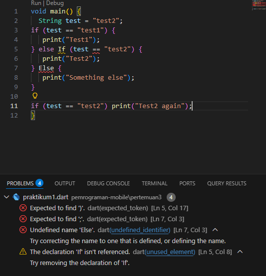
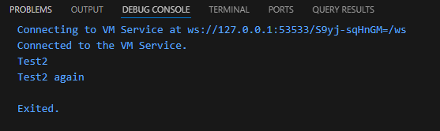
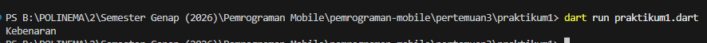
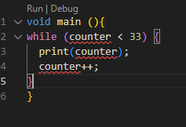
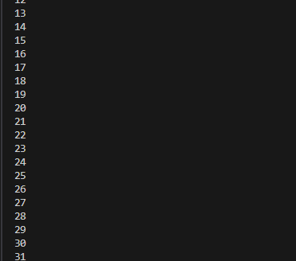
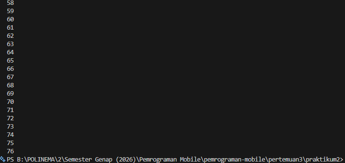
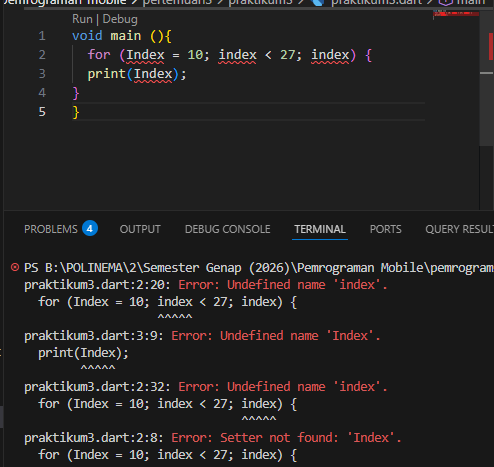
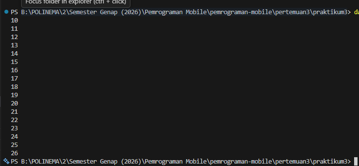
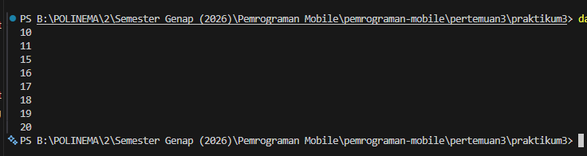

# 📘 Tugas Praktikum - Percabangan & Perulangan (Dart)


## 📝 Praktikum 1 : Menerapkan Control Flows ("if/else")

**Langkah 1**

Ketik atau salin kode program berikut ke dalam fungsi main().
```dart
String test = "test2";
if (test == "test1") {
   print("Test1");
} else If (test == "test2") {
   print("Test2");
} Else {
   print("Something else");
}

if (test == "test2") print("Test2 again");

```


**Langkah 2**

Silakan coba eksekusi (Run) kode pada langkah 1 tersebut. Apa yang terjadi? Jelaskan!

***Jawaban :***

## Screenshot Output


Akan terjadi ERROR (Syntax Error).
Dart case-sensitive (huruf besar/kecil berpengaruh).

Penulisan yang salah :
```dart
else If
Else
```

Penulisan yang benar :
```dart
else if
else
```
## Screenshot Output


**Langkah 3**

Tambahkan kode program berikut, lalu coba eksekusi (Run) kode Anda.

```dart
String test = "true";
if (test) {
   print("Kebenaran");
}
```
***Jawaban :***

Sudah pasti error karena variabel test bertipe String, sedangkan pernyataan if dalam Dart hanya menerima kondisi bertipe boolean (true/false). Oleh karena itu, String tidak dapat langsung digunakan sebagai kondisi dalam if.

yang benar ->
```dart
 String test2 = "true";

  if (test2 == "true") {
    print("Kebenaran");
  } else {
    print("Bukan Kebenaran");
  }
```
## Screenshot Output


## 📝 Praktikum 2 : Menerapkan Perulangan "while" dan "do-while"


**Langkah 1**

Ketik atau salin kode program berikut ke dalam fungsi main()

```dart
while (counter < 33) {
  print(counter);
  counter++;
}
```
***Jawaban :***
## Screenshot Output


**Langkah 2**

***Jawaban :***

Akan terjadi error karena variabel counter belum dideklarasikan dan belum diberi nilai awal.

yang benar ->
```dart
void main() {
  int counter = 0;

  while (counter < 33) {
    print(counter);
    counter++;
  }
}
```
## Screenshot Output

Program akan mencetak angka dari 0 sampai 32.

Kenapa sampai 32?
Karena perulangan berjalan selama counter < 33. Saat counter sudah 33, kondisi menjadi false dan loop berhenti.

**Langkah 3**

Tambahkan kode program berikut, lalu coba eksekusi (Run) kode Anda.
```dart
do {
  print(counter);
  counter++;
} while (counter < 77);
```
Apa yang terjadi ? Jika terjadi error, silakan perbaiki namun tetap menggunakan do-while.

***Jawaban :***
## Screenshot Output

Jika diletakkan setelah while sebelumnya, maka:

- Setelah while pertama selesai, nilai counter adalah 33
- Lalu masuk ke do-while
- do-while akan mencetak dari 33 sampai 76

Kenapa? Karena struktur do-while:

- Blok kode dijalankan terlebih dahulu
- Baru kondisi diperiksa

Artinya, meskipun kondisi salah, kode tetap dijalankan minimal satu kali.

## 📝 Praktikum 3: Menerapkan Perulangan "for" dan "break-continue"

**Langkah 1**

Ketik atau salin kode program berikut ke dalam fungsi main().
```dart
for (Index = 10; index < 27; index) {
  print(Index);
}
```
***Jawaban :***


**Langkah 2**

Silakan coba eksekusi (Run) kode pada langkah 1 tersebut. Apa yang terjadi? Jelaskan! Lalu perbaiki jika terjadi error.

***Jawaban :***

Muncul error (compile error) karena:

- Variabel Index dan index berbeda (huruf besar–kecil berpengaruh di Dart).
- Variabel Index belum dideklarasikan.
- Tidak ada operator increment (index++).
- Sintaks for tidak lengkap.

yang benar ->
```dart
void main() {
  for (int index = 10; index < 27; index++) {
    print(index);
  }
}
```
## Screenshot Output


Angka akan tampil dari 10 sampai 26.

Karena:
- Mulai dari 10
- Berhenti saat < 27
- Bertambah 1 setiap perulangan

**Langkah 3**

Tambahkan kode program berikut di dalam for-loop, lalu coba eksekusi (Run) kode Anda.
```dart
If (Index == 21) break;
Else If (index > 1 || index < 7) continue;
print(index);
```
Apa yang terjadi ? Jika terjadi error, silakan perbaiki namun tetap menggunakan for dan break-continue.

***Jawaban :***

Masalah yang Terjadi:

- If harus huruf kecil → if
- Else If harus → else if
- Index dan index tidak konsisten
- Logika index > 1 || index < 7 selalu TRUE
Karena semua angka pasti lebih dari 1 ATAU kurang dari 7.

yang benar ->
```dart
void main() {
  for (int index = 10; index < 27; index++) {
    if (index == 21) break;
    else if (index > 11 && index < 15) continue;
    print(index);
  }
}
```

## Screenshot Output


- Perulangan dari 10 sampai 26.
- Jika index == 21 → perulangan berhenti (break).
- Jika index > 11 && index < 15 → angka 12, 13, 14 dilewati (continue).
- Angka lainnya akan ditampilkan.
