# 📘 Tugas Praktikum - Collections dan Functions (Dart)

## 📝 Praktikum 1 : Eksperimen Tipe Data List

**Langkah 1**

Ketik atau salin kode program berikut ke dalam void main().

```dart
var list = [1, 2, 3];
assert(list.length == 3);
assert(list[1] == 2);
print(list.length);
print(list[1]);

list[1] = 1;
assert(list[1] == 1);
print(list[1]);
```

***Jawaban :***

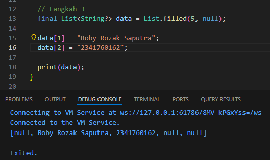

**Langkah 2**

Silakan coba eksekusi (Run) kode pada langkah 1 tersebut. Apa yang terjadi? Jelaskan

***Jawaban :***
## Screenshot Output
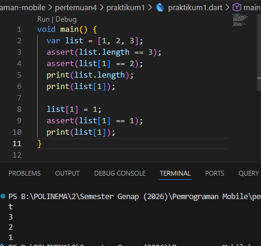

Saat kode dijalankan, program membuat list berisi tiga elemen yaitu [1, 2, 3]. Kemudian assert digunakan untuk mengecek bahwa panjang list adalah 3 dan nilai pada indeks ke-1 adalah 2. Karena kondisi benar, program tidak menghasilkan error. Program lalu menampilkan panjang list (3) dan nilai indeks ke-1 (2). Setelah itu nilai pada indeks ke-1 diubah menjadi 1, lalu ditampilkan kembali sehingga output akhirnya adalah 3, 2, dan 1.

**Langkah 3**

Ubah kode pada langkah 1 menjadi variabel final yang mempunyai index = 5 dengan default value = null. Isilah nama dan NIM Anda pada elemen index ke-1 dan ke-2. Lalu print dan capture hasilnya.

Apa yang terjadi ? Jika terjadi error, silakan perbaiki.

***Jawaban :***

## Screenshot Output


kode diubah dengan menggunakan variabel final dan membuat list dengan panjang 5 yang nilai awal setiap elemennya adalah null. Hal ini berarti list sudah memiliki lima indeks (0–4), tetapi belum berisi data.

Selanjutnya, nama diisi pada indeks ke-1 dan NIM diisi pada indeks ke-2. Meskipun menggunakan final, isi dari list masih bisa diubah selama tidak mengganti variabel list tersebut dengan objek baru.

Ketika program dijalankan dan di-print, maka akan menampilkan list dengan lima elemen, di mana indeks ke-1 berisi nama, indeks ke-2 berisi NIM, dan indeks lainnya tetap null

## 📝 Praktikum 2 : Eksperimen Tipe Data Set

**Langkah 1**

Ketik atau salin kode program berikut ke dalam fungsi main().

```dart
var halogens = {'fluorine', 'chlorine', 'bromine', 'iodine', 'astatine'};
print(halogens);
```

***Jawaban :***
## Screenshot Output
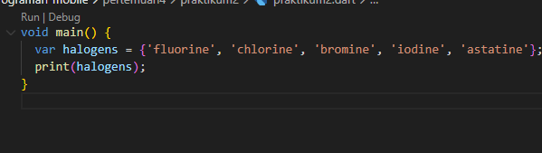

**Langkah 2**

Silakan coba eksekusi (Run) kode pada langkah 1 tersebut. Apa yang terjadi? Jelaskan! Lalu perbaiki jika terjadi error.

***Jawaban :***
## Screenshot Output
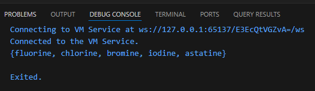

Saat kode dijalankan, program membuat sebuah Set bernama halogens yang berisi beberapa elemen yaitu fluorine, chlorine, bromine, iodine, dan astatine. Set adalah struktur data yang digunakan untuk menyimpan kumpulan data unik (tidak boleh ada duplikasi). Kemudian perintah print(halogens);

**Langkah 3**

Tambahkan kode program berikut, lalu coba eksekusi (Run) kode Anda.

```dart
var names1 = <String>{};
Set<String> names2 = {}; // This works, too.
var names3 = {}; // Creates a map, not a set.

print(names1);
print(names2);
print(names3);
```
Apa yang terjadi ? Jika terjadi error, silakan perbaiki namun tetap menggunakan ketiga variabel tersebut. Tambahkan elemen nama dan NIM Anda pada kedua variabel Set tersebut dengan dua fungsi berbeda yaitu .add() dan .addAll(). Untuk variabel Map dihapus, nanti kita coba di praktikum selanjutnya.

***Jawaban :***
## Screenshot Output

Dibuat tiga variabel yaitu names1, names2, dan names3. Variabel names1 dan names2 merupakan Set bertipe String, sedangkan names3 sebenarnya membuat Map kosong, bukan Set. Karena praktikum ini membahas Set, maka variabel names3 dihapus. Selanjutnya elemen nama dan NIM ditambahkan ke names1 menggunakan fungsi .add() dan ke names2 menggunakan fungsi .addAll(), lalu hasilnya ditampilkan dengan print()

Perbaikan :
## Screenshot Output
```dart
  var halogens = {'fluorine', 'chlorine', 'bromine', 'iodine', 'astatine'};
  print(halogens);

  var names1 = <String>{};
  Set<String> names2 = {};

  names1.add("Boby Rozak Saputra");
  names1.add("2341760162");

  names2.addAll({"Boby Rozak Saputra","2341760162"});

  print(names1);
  print(names2);
```
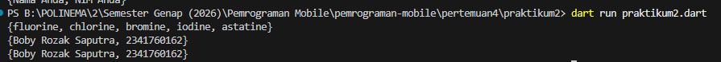
Perbaikannya dilakukan dengan menghapus variabel names3 karena variabel tersebut membuat Map, bukan Set. Kemudian elemen nama dan NIM ditambahkan ke dua variabel Set yang tersisa. Pada names1 digunakan fungsi .add() untuk menambahkan elemen satu per satu, sedangkan pada names2 digunakan fungsi .addAll() untuk menambahkan beberapa elemen sekaligus. Setelah itu, kedua Set ditampilkan menggunakan print()

## 📝 Praktikum 3 : Eksperimen Tipe Data Maps

**Langkah 1** 

Ketik atau salin kode program berikut ke dalam fungsi main().
```dart
var gifts = {
  // Key:    Value
  'first': 'partridge',
  'second': 'turtledoves',
  'fifth': 1
};

var nobleGases = {
  2: 'helium',
  10: 'neon',
  18: 2,
};

print(gifts);
print(nobleGases);
```
***Jawaban :***
## Screenshot Output
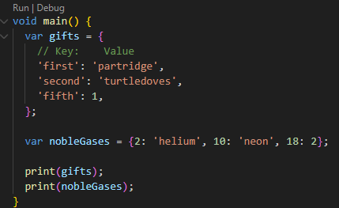

**Langkah 2**

Silakan coba eksekusi (Run) kode pada langkah 1 tersebut. Apa yang terjadi? Jelaskan! Lalu perbaiki jika terjadi error.

***Jawaban :***
## Screenshot Output
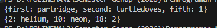

Setelah program dijalankan, kode berhasil dieksekusi dan menampilkan isi dari Map gifts dan nobleGases. Namun terdapat ketidakkonsistenan tipe data pada value, karena sebagian bertipe String dan sebagian bertipe integer. Hal ini tidak menyebabkan error karena menggunakan var, tetapi sebaiknya semua value dibuat dengan tipe yang sama agar lebih konsisten.

Perbaikan :
```dart
  var gifts = {
    'first': 'partridge',
    'second': 'turtledoves',
    'fifth': 'golden rings',
  };

  var nobleGases = {2: 'helium', 10: 'neon', 18: 'argon'};

  print(gifts);
  print(nobleGases);
  ```
## Screenshot Output
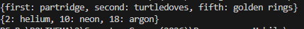

**Langkah 3**

Tambahkan kode program berikut, lalu coba eksekusi (Run) kode Anda.
```dart
var mhs1 = Map<String, String>();
gifts['first'] = 'partridge';
gifts['second'] = 'turtledoves';
gifts['fifth'] = 'golden rings';

var mhs2 = Map<int, String>();
nobleGases[2] = 'helium';
nobleGases[10] = 'neon';
nobleGases[18] = 'argon';
```
Apa yang terjadi ? Jika terjadi error, silakan perbaiki.

Tambahkan elemen nama dan NIM Anda pada tiap variabel di atas (gifts, nobleGases, mhs1, dan mhs2)

***Jawaban :***

```dart
var gifts = {
    'first': 'partridge',
    'second': 'turtledoves',
    'fifth': 'golden rings',
    'nama': 'Boby',
    'nim': '2341760162'
  };

  var nobleGases = {
    2: 'helium',
    10: 'neon',
    18: 'argon',
    1: 'Boby',
    21: '2341760162'
  };

  var mhs1 = Map<String, String>();
  mhs1['nama'] = 'Boby';
  mhs1['nim'] = '2341760162';

  var mhs2 = Map<int, String>();
  mhs2[1] = 'Justin';
  mhs2[2] = '2431760126';

  print(gifts);
  print(nobleGases);
  print(mhs1);
  print(mhs2);
```
## Screenshot Output
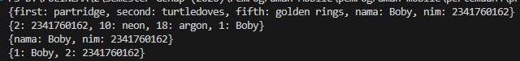

Pada langkah ini ditambahkan dua variabel baru yaitu mhs1 dan mhs2. Variabel mhs1 menggunakan Map<String, String> sehingga key dan value bertipe String, sedangkan mhs2 menggunakan Map<int, String> sehingga key bertipe integer dan value bertipe String.

Saat program dijalankan tidak terjadi error, tetapi mhs1 dan mhs2 tetap kosong karena kode yang ditambahkan justru mengubah isi gifts dan nobleGases. Oleh karena itu, data seharusnya dimasukkan langsung ke mhs1 dan mhs2, serta ditambahkan juga elemen nama dan NIM pada setiap Map (gifts, nobleGases, mhs1, dan mhs2).

## 📝 Praktikum 4 : Eksperimen Tipe Data List: Spread dan Control-flow Operators

**Langkah 1** 

Ketik atau salin kode program berikut ke dalam fungsi main().

```dart
var list = [1, 2, 3];
var list2 = [0, ...list];
print(list1);
print(list2);
print(list2.length);
```
***Jawaban :***
## Screenshot Output
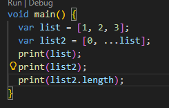

**Langkah 2**

Silakan coba eksekusi (Run) kode pada langkah 1 tersebut. Apa yang terjadi? Jelaskan! Lalu perbaiki jika terjadi error.

***Jawaban :***
## Screenshot Output
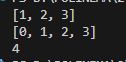

Spread operator menambahkan semua isi list ke list2.

**Langkah 3**

Tambahkan kode program berikut, lalu coba eksekusi (Run) kode Anda.
```dart
list1 = [1, 2, null];
print(list1);
var list3 = [0, ...?list1];
print(list3.length);
```
Tambahkan variabel list berisi NIM Anda menggunakan Spread Operators.

***Jawaban :***
Variabel list1 belum dideklarasikan.

Perbaikan :
```dart
  var list = [1, 2, 3];
  var list2 = [0, ...list];

  print(list);
  print(list2);
  print(list2.length);

  var list1 = [1, 2, null];
  print(list1);

  var list3 = [0, ...?list1];
  print(list3);
  print(list3.length);
```
## Screenshot Output
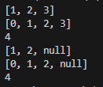

...? digunakan untuk menghindari error jika list bernilai null

Tambahan :
```dart
var nim = [2,3,4,1,7,2,0,0,0,1];
var dataNim = [0, ...nim];

print(dataNim);
```
## Screenshot Output
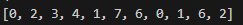

**Langkah 4**

Tambahkan kode program berikut, lalu coba eksekusi (Run) kode Anda.
```dart
var nav = ['Home', 'Furniture', 'Plants', if (promoActive) 'Outlet'];
print(nav);
```
Apa yang terjadi ? Jika terjadi error, silakan perbaiki. Tunjukkan hasilnya jika variabel promoActive ketika true dan false.

***Jawaban :***

Variabel promoActive belum dideklarasikan.
```dart
void main() {
  bool promoActive = true;

  var nav = ['Home', 'Furniture', 'Plants', if (promoActive) 'Outlet'];
  print(nav);
}
```

## Screenshot Output
***True***

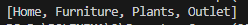

***False***

.png)

Fitur ini disebut Collection If

Manfaat:
Menambahkan elemen ke list berdasarkan kondisi.

**Langkah 5**

Tambahkan kode program berikut, lalu coba eksekusi (Run) kode Anda.
```dart
var nav2 = ['Home', 'Furniture', 'Plants', if (login case 'Manager') 'Inventory'];
print(nav2);
```
Apa yang terjadi ? Jika terjadi error, silakan perbaiki. Tunjukkan hasilnya jika variabel login mempunyai kondisi lain.

***Jawaban :***
Variabel login belum dideklarasikan.

Perbaikan :
## Screenshot Output

***Manager***

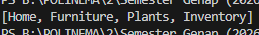

***User***

.png)


**Langkah 6**

Tambahkan kode program berikut, lalu coba eksekusi (Run) kode Anda.

```dart
var listOfInts = [1, 2, 3];
var listOfStrings = ['#0', for (var i in listOfInts) '#$i'];
assert(listOfStrings[1] == '#1');
print(listOfStrings);
```
Apa yang terjadi ? Jika terjadi error, silakan perbaiki. Jelaskan manfaat Collection For dan dokumentasikan hasilnya.

***Jawaban :***
## Screenshot Output
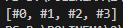

Penjelasan
for di dalam list digunakan untuk membuat data list secara otomatis.

- Manfaat Collection For
- Membuat list lebih cepat
- Kode lebih singkat
- Tidak perlu loop terpisah

## 📝 Praktikum 5 : Eksperimen Tipe Data Records

**Langkah 1**

Ketik atau salin kode program berikut ke dalam fungsi main().

```dart
var record = ('first', a: 2, b: true, 'last');
print(record)
```

***Jawaban :***
## Screenshot Output
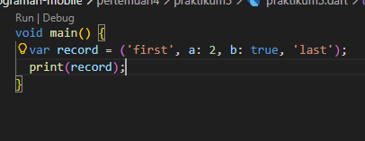
**Langkah 2**

Silakan coba eksekusi (Run) kode pada langkah 1 tersebut. Apa yang terjadi? Jelaskan! Lalu perbaiki jika terjadi error.

***Jawaban :***
## Screenshot Output
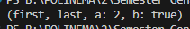

Kode tersebut membuat record dengan isi:

- field posisi: 'first' dan 'last'
- field bernama: a = 2 dan b = true

**Langkah 3**

Tambahkan kode program berikut di luar scope void main(), lalu coba eksekusi (Run) kode Anda.

```dart
(int, int) tukar((int, int) record) {
  var (a, b) = record;
  return (b, a);
}
```
Apa yang terjadi ? Jika terjadi error, silakan perbaiki. Gunakan fungsi tukar() di dalam main() sehingga tampak jelas proses pertukaran value field di dalam Records.

***Jawaban :***

## Screenshot Output
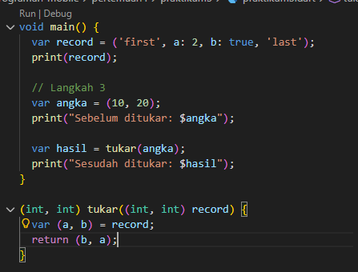
.png)

Fungsi ini:
- menerima record (int, int)
- menukar posisi nilainya
- menggunakan destructuring

**Langkah 4**

Tambahkan kode program berikut di dalam scope void main(), lalu coba eksekusi (Run) kode Anda.
```dart
// Record type annotation in a variable declaration:
(String, int) mahasiswa;
print(mahasiswa);
```
Apa yang terjadi ? Jika terjadi error, silakan perbaiki. Inisialisasi field nama dan NIM Anda pada variabel record mahasiswa di atas.

***Jawaban :***

Akan muncul error karena variabel mahasiswa belum diinisialisasi.

Perbaikan : Isi dengan nama dan NIM.

```dart
void main() {

  (String, int) mahasiswa;

  mahasiswa = ('Boby Rozak Saputra', 2341760162);

  print(mahasiswa);
}
```
## Screenshot Output
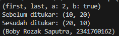

Setelah kode diperbaiki, variabel record mahasiswa yang sebelumnya hanya dideklarasikan kini telah diinisialisasi dengan nilai berupa nama dan NIM. Hal ini dilakukan karena pada Dart variabel dengan tipe non-nullable harus diberi nilai sebelum digunakan. Setelah dilakukan inisialisasi, program dapat dijalankan tanpa error dan perintah print(mahasiswa); akan menampilkan isi record yang berisi nama dan NIM yang telah dimasukkan. Output yang dihasilkan berupa record dengan dua field, yaitu field pertama bertipe String untuk nama dan field kedua bertipe int untuk NIM.

**Langkah 5**

Tambahkan kode program berikut di dalam scope void main(), lalu coba eksekusi (Run) kode Anda.
```dart
var mahasiswa2 = ('first', a: 2, b: true, 'last');

print(mahasiswa2.$1); // Prints 'first'
print(mahasiswa2.a); // Prints 2
print(mahasiswa2.b); // Prints true
print(mahasiswa2.$2); // Prints 'last'
```
Apa yang terjadi ? Jika terjadi error, silakan perbaiki. Gantilah salah satu isi record dengan nama dan NIM Anda, lalu dokumentasikan hasilnya dan buat laporannya!

***Jawaban :***
## Screenshot Output
```dart
  var mahasiswa2 = ('Boby Rozak Saputra', a: 2341760162, b: true, 'SIB');

  print(mahasiswa2.$1); // Prints 'first'
  print(mahasiswa2.a); // Prints 2
  print(mahasiswa2.b); // Prints true
  print(mahasiswa2.$2); // Prints 'last'
```
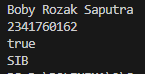

Pada langkah ini dibuat record mahasiswa2 yang memiliki field posisi dan field bernama. Field posisi diakses menggunakan $1 dan $2, sedangkan field bernama diakses menggunakan .a dan .b. Saat program dijalankan, setiap print() menampilkan nilai dari masing-masing field sesuai dengan cara pemanggilannya. Jika salah satu isi record diganti dengan nama dan NIM, maka output akan menampilkan nilai yang telah diubah tersebut.