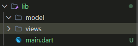
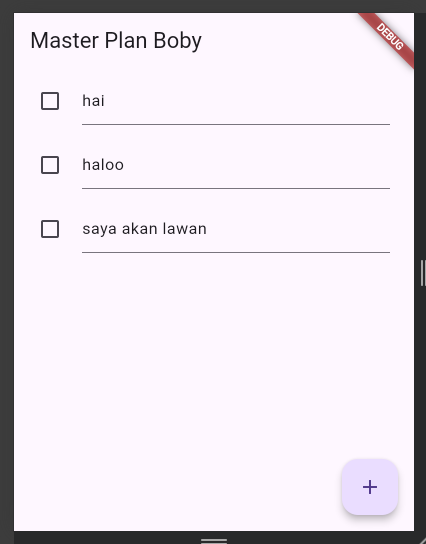
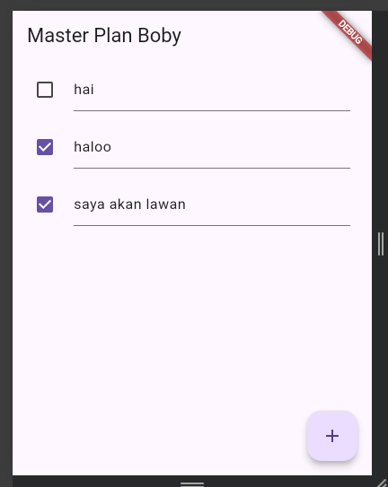
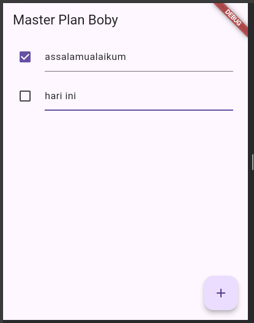
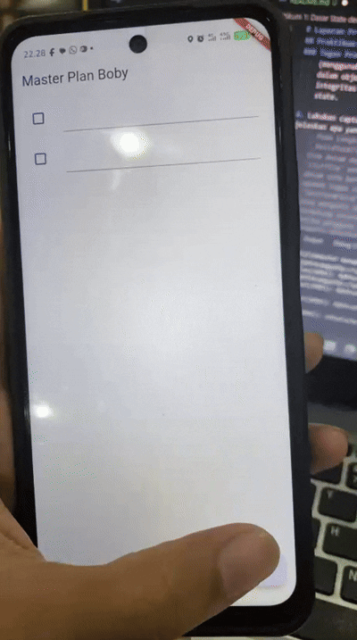

# Laporan Praktikum #10 Dasar State Management

## Praktikum 1: Dasar State dengan Model-View

### Langkah 1: Buat Project Baru

Buatlah sebuah project flutter baru dengan nama master_plan di folder src week-10 repository GitHub Anda atau sesuai style laporan praktikum yang telah disepakati. Lalu buatlah susunan folder dalam project seperti gambar berikut ini.



### Langkah 2: Membuat model task.dart

Praktik terbaik untuk memulai adalah pada lapisan data (data layer). Ini akan memberi Anda gambaran yang jelas tentang aplikasi Anda, tanpa masuk ke detail antarmuka pengguna Anda. Di folder model, buat file bernama 'task.dart' dan buat 'class Task'. Class ini memiliki atribut 'description' dengan tipe data String dan 'complete' dengan tipe data Boolean, serta ada konstruktor. Kelas ini akan menyimpan data tugas untuk aplikasi kita. Tambahkan kode berikut:

```dart
class Task {
  final String description;
  final bool complete;
  
  const Task({
    this.complete = false,
    this.description = '',
  });
}
```
### Langkah 3: Buat file plan.dart


Kita juga perlu sebuah List untuk menyimpan daftar rencana dalam aplikasi to-do ini. Buat file plan.dart di dalam folder models dan isi kode seperti berikut.

```dart
import './task.dart';

class Plan {
  final String name;
  final List<Task> tasks;
  
  const Plan({this.name = '', this.tasks = const []});
}
```

### Langkah 4: Buat file data_layer.dart

Kita dapat membungkus beberapa data layer ke dalam sebuah file yang nanti akan mengekspor kedua model tersebut. Dengan begitu, proses impor akan lebih ringkas seiring berkembangnya aplikasi. Buat file bernama data_layer.dart di folder models. Kodenya hanya berisi export seperti berikut.

```dart
export 'plan.dart';
export 'task.dart';
```

### Langkah 5: Pindah ke file main.dart

Ubah isi kode main.dart sebagai berikut.

```dart
import 'package:flutter/material.dart';
import './views/plan_screen.dart';

void main() => runApp(MasterPlanApp());

class MasterPlanApp extends StatelessWidget {
  const MasterPlanApp({super.key});

  @override
  Widget build(BuildContext context) {
    return MaterialApp(
     theme: ThemeData(primarySwatch: Colors.purple),
     home: PlanScreen(),
    );
  }
}
```
### Langkah 6: buat plan_screen.dart

Pada folder views, buatlah sebuah file plan_screen.dart dan gunakan templat StatefulWidget untuk membuat class PlanScreen. Isi kodenya adalah sebagai berikut. Gantilah teks ‘Namaku' dengan nama panggilan Anda pada title AppBar.

```dart
import '../models/data_layer.dart';
import 'package:flutter/material.dart';

class PlanScreen extends StatefulWidget {
  const PlanScreen({super.key});

  @override
  State createState() => _PlanScreenState();
}

class _PlanScreenState extends State<PlanScreen> {
  Plan plan = const Plan();

  @override
  Widget build(BuildContext context) {
   return Scaffold(
    // ganti ‘Namaku' dengan Nama panggilan Anda
    appBar: AppBar(title: const Text('Master Plan Namaku')),
    body: _buildList(),
    floatingActionButton: _buildAddTaskButton(),
   );
  }
}
```

### Langkah 7: buat method _buildAddTaskButton()

Anda akan melihat beberapa error di langkah 6, karena method yang belum dibuat. Ayo kita buat mulai dari yang paling mudah yaitu tombol Tambah Rencana. Tambah kode berikut di bawah method build di dalam class _PlanScreenState.

```dart
Widget _buildAddTaskButton() {
  return FloatingActionButton(
   child: const Icon(Icons.add),
   onPressed: () {
     setState(() {
      plan = Plan(
       name: plan.name,
       tasks: List<Task>.from(plan.tasks)
       ..add(const Task()),
     );
    });
   },
  );
}
```
### Langkah 8: buat widget _buildList()

Kita akan buat widget berupa List yang dapat dilakukan scroll, yaitu ListView.builder. Buat widget ListView seperti kode berikut ini.

```dart
Widget _buildList() {
  return ListView.builder(
   itemCount: plan.tasks.length,
   itemBuilder: (context, index) =>
   _buildTaskTile(plan.tasks[index], index),
  );
}
```
### Langkah 9: buat widget _buildTaskTile

Dari langkah 8, kita butuh ListTile untuk menampilkan setiap nilai dari plan.tasks. Kita buat dinamis untuk setiap index data, sehingga membuat view menjadi lebih mudah. Tambahkan kode berikut ini.
```dart
 Widget _buildTaskTile(Task task, int index) {
    return ListTile(
      leading: Checkbox(
          value: task.complete,
          onChanged: (selected) {
            setState(() {
              plan = Plan(
                name: plan.name,
                tasks: List<Task>.from(plan.tasks)
                  ..[index] = Task(
                    description: task.description,
                    complete: selected ?? false,
                  ),
              );
            });
          }),
      title: TextFormField(
        initialValue: task.description,
        onChanged: (text) {
          setState(() {
            plan = Plan(
              name: plan.name,
              tasks: List<Task>.from(plan.tasks)
                ..[index] = Task(
                  description: text,
                  complete: task.complete,
                ),
            );
          });
        },
      ),
    );
  }
  ```
 Run atau tekan F5 untuk melihat hasil aplikasi yang Anda telah buat. Capture hasilnya untuk soal praktikum nomor 4.




### Langkah 10: Tambah Scroll Controller
Anda dapat menambah tugas sebanyak-banyaknya, menandainya jika sudah beres, dan melakukan scroll jika sudah semakin banyak isinya. Namun, ada salah satu fitur tertentu di iOS perlu kita tambahkan. Ketika keyboard tampil, Anda akan kesulitan untuk mengisi yang paling bawah. Untuk mengatasi itu, Anda dapat menggunakan ScrollController untuk menghapus focus dari semua TextField selama event scroll dilakukan. Pada file plan_screen.dart, tambahkan variabel scroll controller di class State tepat setelah variabel plan.
```dart
late ScrollController scrollController;
```

### Langkah 11: Tambah Scroll Listener

Tambahkan method initState() setelah deklarasi variabel scrollController seperti kode berikut.
```dart
@override
void initState() {
  super.initState();
  scrollController = ScrollController()
    ..addListener(() {
      FocusScope.of(context).requestFocus(FocusNode());
    });
}
```
### Langkah 12: Tambah controller dan keyboard behavior

Tambahkan controller dan keyboard behavior pada ListView di method _buildList seperti kode berikut ini.

```dart
return ListView.builder(
  controller: scrollController,
 keyboardDismissBehavior: Theme.of(context).platform ==
 TargetPlatform.iOS
          ? ScrollViewKeyboardDismissBehavior.onDrag
          : ScrollViewKeyboardDismissBehavior.manual,
```
### Langkah 13: Terakhir, tambah method dispose()
Terakhir, tambahkan method dispose() berguna ketika widget sudah tidak digunakan lagi.

```dart
@override
void dispose() {
  scrollController.dispose();
  super.dispose();
}
```



Catatan: Kedua fitur hot reload dan hot restart memiliki performa lebih cepat dibanding melakukan build ulang secara keseluruhan aplikasi. Secara umum:

- Gunakan hot reload untuk melihat perubahan pada tampilan UI, jadi perubahan paling banyak terjadi di metode build. State pada aplikasi tetap dipertahankan dan Anda akan melihat perubahannya hampir secara instan.
- Gunakan hot restart untuk melihat perubahan pada state aplikasi, seperti memperbarui variabel global, static fields, atau metode main(). Kondisi app state akan reset (kembali seperti awal).

### Tugas Praktikum 1: Dasar State dengan Model-View

1. Selesaikan langkah-langkah praktikum tersebut, lalu dokumentasikan berupa GIF hasil akhir praktikum beserta penjelasannya di file README.md! Jika Anda menemukan ada yang error atau tidak berjalan dengan baik, silakan diperbaiki.

2. Jelaskan maksud dari langkah 4 pada praktikum tersebut! Mengapa dilakukan demikian?
    - Langkah 4 bertujuan untuk membuat barrel file (data_layer.dart) yang mengekspor model plan.dart dan task.dart. Hal ini dilakukan untuk menyederhanakan proses impor. Dengan adanya barrel file, kita hanya perlu melakukan satu kali impor data_layer.dart di file lain (seperti main.dart atau plan_screen.dart) untuk mengakses semua model yang ada, sehingga kode menjadi lebih bersih dan mudah dikelola seiring bertambahnya jumlah model.

3. Mengapa perlu variabel plan di langkah 6 pada praktikum tersebut? Mengapa dibuat konstanta ?
    - Mengapa perlu: Variabel plan berfungsi sebagai source of truth atau penyimpan status (state) utama dari aplikasi Master Plan. Variabel ini menampung data rencana beserta daftar tugasnya yang akan ditampilkan dan diubah oleh pengguna di dalam PlanScreen.
    - Mengapa konstanta: Inisialisasi const Plan() memberikan nilai awal yang immutable (tidak dapat diubah secara langsung). Dalam pola pengembangan Flutter, kita cenderung mengganti objek state lama dengan objek baru (menggunakan setState) daripada memodifikasi properti di dalam objek yang sudah ada. Ini membantu menjaga integritas data dan mempermudah pelacakan perubahan state.

4. Lakukan capture hasil dari Langkah 9 berupa GIF, kemudian jelaskan apa yang telah Anda buat!
    
    - Pada Langkah 9, saya telah berhasil mengimplementasikan antarmuka daftar tugas (To-Do List) yang interaktif. Pengguna dapat menambah item tugas baru melalui tombol '+', mengetik deskripsi tugas pada TextFormField, dan menandai status penyelesaian tugas menggunakan Checkbox. Berkat penggunaan ListView.builder, aplikasi dapat menangani daftar tugas dalam jumlah banyak secara efisien.
5. Apa kegunaan method pada Langkah 11 dan 13 dalam lifecyle state ?
    - initState() (Langkah 11): Adalah method yang dipanggil tepat satu kali saat widget pertama kali dimasukkan ke dalam tree. Kegunaannya di sini adalah untuk menginisialisasi ScrollController dan menambahkan listener yang akan secara otomatis menghilangkan fokus (menutup keyboard) ketika pengguna melakukan scroll.
    - dispose() (Langkah 13): Adalah method yang dipanggil saat widget akan dihapus secara permanen dari tree. Kegunaannya adalah untuk melakukan pembersihan sumber daya (cleanup). Dalam kasus ini, scrollController.dispose() dipanggil untuk membebaskan memori dan mencegah kebocoran memori (memory leak) yang disebabkan oleh controller yang tidak ditutup.