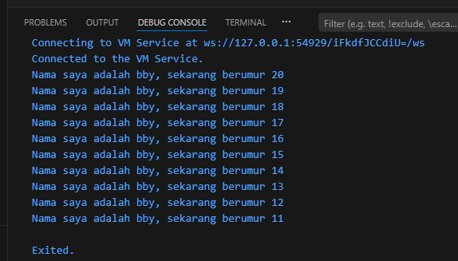

# 📘 Tugas Praktikum - Variabel & Tipe Data (Dart)


## 📝 Soal 1

Modifikasilah kode pada baris ke-3 agar menghasilkan output sesuai yang diminta (ganti "Fulan" dengan nama Anda).

```dart
void main() {
  for (int i = 0; i < 10; i++) {
    print('hello ${i + 2}');
  }
}
```

**Jawaban :**
```dart
void main() {
  for (int i = 0; i < 10; i++) {
    print('Nama saya adalah bby, sekarang berumur ${22 - i}');
  }
}
```

## Screenshot Output


## 📝 Soal 2
Mengapa sangat penting untuk memahami bahasa pemrograman Dart sebelum kita menggunakan framework Flutter ? Jelaskan!

**Jawaban :**

Semua kode Flutter ditulis dengan Dart (widget, layout, navigasi, dan logika aplikasi).

Konsep dasar seperti variabel, function, class, dan null safety berasal dari Dart.

Mempermudah memahami dan memperbaiki error (debugging).

Membantu menulis kode yang lebih rapi, efisien, dan aman.

Kesimpulan:

Dart adalah dasar dari Flutter. Jika memahami Dart dengan baik, maka belajar dan membuat aplikasi Flutter akan jauh lebih mudah.


## 📝 Soal 3
Rangkumlah materi dari codelab ini menjadi poin-poin penting yang dapat Anda gunakan untuk membantu proses pengembangan aplikasi mobile menggunakan framework Flutter

**Jawaban :**

1. Bahasa Dart adalah dasar Flutter
Dart dipilih sebagai bahasa pemrograman utama Flutter karena modern dan mendukung pengembangan aplikasi mobile cross-platform.

2. Dart punya fitur bahasa modern

    - Tooling yang produktif (IDE, analisis kode)

    - Garbage collection otomatis

    - Type annotations dan type safety

    - Bisa dikompilasi ke banyak platform (web, native ARM/x86).

3. Sejarah dan tujuan Dart

    - Awalnya fokus ke web

    - Sekarang fokus ke mobile dan Flutter

    - Dirancang fleksibel dan kuat dibandingkan JavaScript.

4. Cara menjalankan kode Dart

    - Dengan Dart VM menggunakan JIT (debug & hot reload)

    - Dengan AOT untuk performa tinggi produksi tanpa fitur debug.

5. Hot Reload berasal dari Dart JIT
    Fitur ini membuat pengembangan lebih cepat karena perubahan kode langsung terlihat saat running.

6. Dasar sintaks Dart umum & mirip bahasa lain

    - Struktur program dimulai dari void main()

    - Kontrol alur (loop, kondisi), tipe data, operators dasar tersedia seperti bahasa tinggi lainnya.

    - Dart mendukung Object-Oriented Programming (OOP)

    - Dart menggunakan kelas (class), objek, methods

    - Konsep OOP seperti encapsulation, inheritance, abstraction dipakai.

7. Operator di Dart cukup lengkap

    - Aritmatik (+, -, *, /, ~/, %)

    - Relational (==, !=, <, >, dll)

    - Logical (&&, ||, !).

## 📝 Soal 4
Buatlah penjelasan dan contoh eksekusi kode tentang perbedaan Null Safety dan Late variabel !

Kumpulkan jawaban Anda kepada dosen pengampu sesuai kesepakatan di kelas.

**Jawaban :**

**Null Safety**
adalah fitur pada Dart yang mencegah variabel memiliki nilai null secara tidak sengaja.
Dengan Null Safety, kita harus secara eksplisit menentukan apakah sebuah variabel boleh bernilai null atau tidak.


```dart
void main() {
  String nama = "Boby";
  print(nama);
}
```

Artinya:

    - String nama; → tidak boleh null

    - String? nama; → boleh null

**Late Variabel**
Keyword late digunakan untuk mendeklarasikan variabel non-nullable yang akan diinisialisasi nanti, tetapi sebelum digunakan harus sudah memiliki nilai.

```dart
void main() {
  late String nama;
  nama = "Boby";
  print(nama);
}
```

Artinya:

    - Variabel tidak langsung diberi nilai saat deklarasi

    - Namun Dart percaya bahwa variabel pasti diisi sebelum dipakai