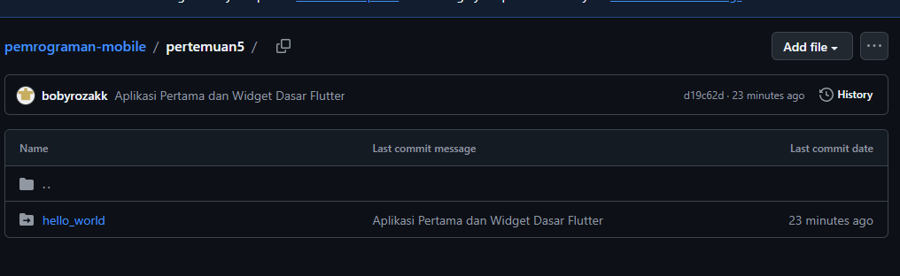

# 📘 Tugas Praktikum - Aplikasi Pertama & Widget Dasar Flutter

## 📝 Praktikum 1 : Membuat Project Flutter Baru

## 📝 Praktikum 2 : Menghubungkan Perangkat Android atau Emulator

## 📝 Praktikum 3 : Membuat Repository GitHub dan Laporan Praktikum

