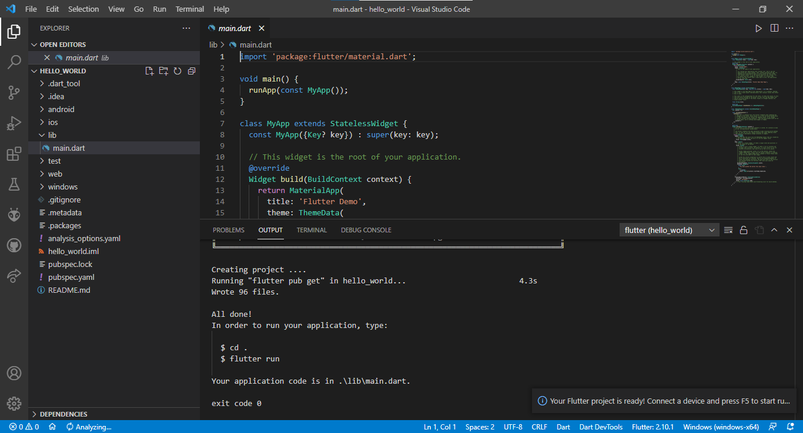
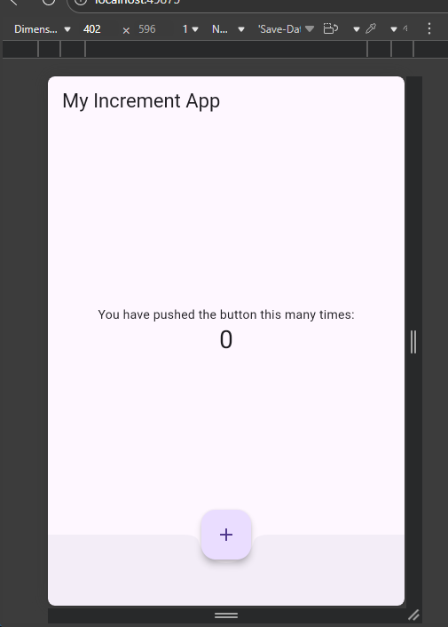
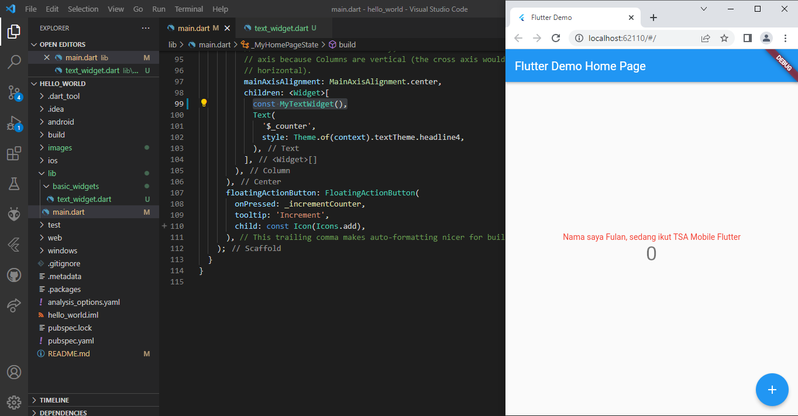
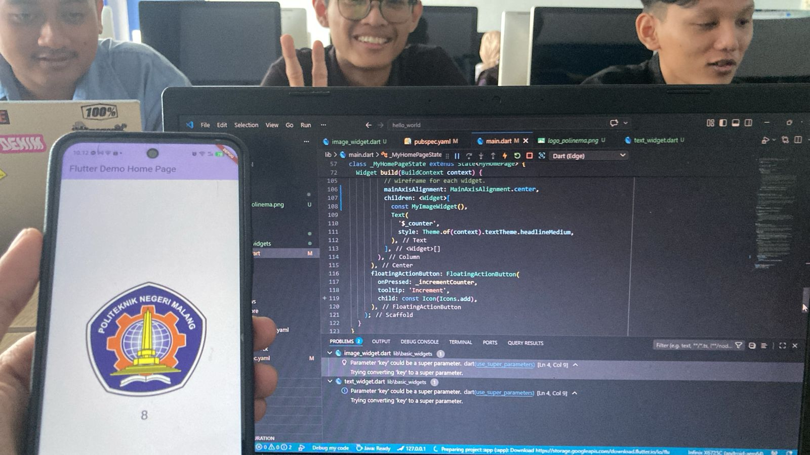
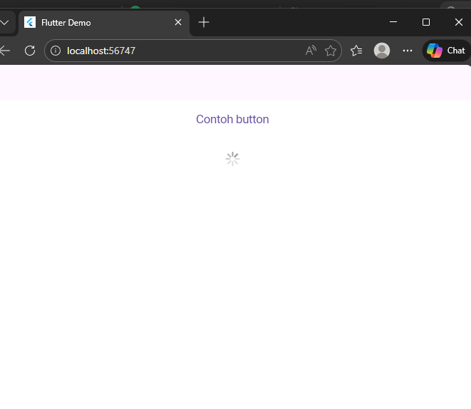
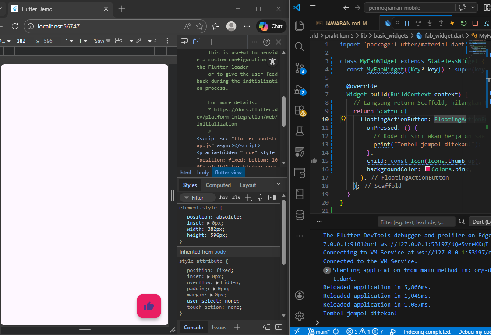

# 📘 Tugas Praktikum - Aplikasi Pertama & Widget Dasar Flutter

## 📝 Praktikum 1 : Membuat Project Flutter Baru



## 📝 Praktikum 2 : Menghubungkan Perangkat Android atau Emulator



## 📝 Praktikum 3 : Membuat Repository GitHub dan Laporan Praktikum


## 📝 Praktikum 4 : Menerapkan Widget Dasar

**Langkah 1 : Text Widget**

Buat folder baru basic_widgets di dalam folder lib. Kemudian buat file baru di dalam basic_widgets dengan nama text_widget.dart. Ketik atau salin kode program berikut ke project hello_world Anda pada file text_widget.dart

``` dart
import 'package:flutter/material.dart';

class MyTextWidget extends StatelessWidget {
  const MyTextWidget({Key? key}) : super(key: key);

  @override
  Widget build(BuildContext context) {
    return const Text(
      "Nama saya Fulan, sedang belajar Pemrograman Mobile",
      style: TextStyle(color: Colors.red, fontSize: 14),
      textAlign: TextAlign.center);
  }
}
```

***Jawaban :***


**Langkah 2 : Image Widget**

Buat sebuah file image_widget.dart di dalam folder basic_widgets dengan isi kode berikut.

```dart
import 'package:flutter/material.dart';

class MyImageWidget extends StatelessWidget {
  const MyImageWidget({Key? key}) : super(key: key);

  @override
  Widget build(BuildContext context) {
    return const Image(
      image: AssetImage("logo_polinema.jpg")
    );
  }
}
```

***Jawaban :***



## 📝 Praktikum 5 : Menerapkan Widget Material Design dan iOS Cupertino

**Langkah 1 : Cupertino Button dan Loading Bar**

Buat file di basic_widgets > loading_cupertino.
dart. Import stateless widget dari material dan cupertino. Lalu isi kode di dalam method Widget build adalah sebagai berikut.
```dart
return MaterialApp(
      home: Container(
        margin: const EdgeInsets.only(top: 30),
        color: Colors.white,
        child: Column(
          children: <Widget>[
            CupertinoButton(
              child: const Text("Contoh button"),
              onPressed: () {},
            ),
            const CupertinoActivityIndicator(),
          ],
        ),
      ),
    );
```

***Jawaban :***



**Langkah 2 : Cupertino Button dan Loading Bar**

Button widget terdapat beberapa macam pada flutter yaitu ButtonBar, DropdownButton, TextButton, FloatingActionButton, IconButton, OutlineButton, PopupMenuButton, dan ElevatedButton.

Buat file di basic_widgets > fab_widget.dart. Import stateless widget dari material. Lalu isi kode di dalam method Widget build adalah sebagai berikut.
  ```dart
  return MaterialApp(
        home: Scaffold(
          floatingActionButton: FloatingActionButton(
            onPressed: () {
              // Add your onPressed code here!
            },
            child: const Icon(Icons.thumb_up),
            backgroundColor: Colors.pink,
          ),
        ),
      );
  ```
  ***Jawaban :***



**Langkah 3 : Scaffold Widget**

Scaffold widget digunakan untuk mengatur tata letak sesuai dengan material design.
```dart
import 'package:flutter/material.dart';

void main() {
  runApp(const MyApp());
}

class MyApp extends StatelessWidget {
  const MyApp({Key? key}) : super(key: key);

  // This widget is the root of your application.
  @override
  Widget build(BuildContext context) {
    return MaterialApp(
      title: 'Flutter Demo',
      theme: ThemeData(
        primarySwatch: Colors.red,
      ),
      home: const MyHomePage(title: 'My Increment App'),
    );
  }
}

class MyHomePage extends StatefulWidget {
  const MyHomePage({Key? key, required this.title}) : super(key: key);

  final String title;

  @override
  State<MyHomePage> createState() => _MyHomePageState();
}

class _MyHomePageState extends State<MyHomePage> {
  int _counter = 0;

  void _incrementCounter() {
    setState(() {
      _counter++;
    });
  }

  @override
  Widget build(BuildContext context) {
    return Scaffold(
      appBar: AppBar(
        title: Text(widget.title),
      ),
      body: Center(
        child: Column(
          mainAxisAlignment: MainAxisAlignment.center,
          children: <Widget>[
            const Text(
              'You have pushed the button this many times:',
            ),
            Text(
              '$_counter',
              style: Theme.of(context).textTheme.headline4,
            ),
          ],
        ),
      ),
      bottomNavigationBar: BottomAppBar(
        child: Container(
          height: 50.0,
        ),
      ),
      floatingActionButton: FloatingActionButton(
        onPressed: _incrementCounter,
        tooltip: 'Increment Counter',
        child: const Icon(Icons.add),
      ), 
      floatingActionButtonLocation: FloatingActionButtonLocation.centerDocked,
    );
  }
}
```
  ***Jawaban :***

  

**Langkah 4: Dialog Widget**

Dialog widget pada flutter memiliki dua jenis dialog yaitu AlertDialog dan SimpleDialog.

Ubah isi kode main.dart seperti berikut.

```dart
class MyApp extends StatelessWidget {
  const MyApp({Key? key}) : super(key: key);

  @override
  Widget build(BuildContext context) {
    return const MaterialApp(
      home: Scaffold(
        body: MyLayout(),
      ),
    );
  }
}

class MyLayout extends StatelessWidget {
  const MyLayout({Key? key}) : super(key: key);

  @override
  Widget build(BuildContext context) {
    return Padding(
      padding: const EdgeInsets.all(8.0),
      child: ElevatedButton(
        child: const Text('Show alert'),
        onPressed: () {
          showAlertDialog(context);
        },
      ),
    );
  }
}

showAlertDialog(BuildContext context) {
  // set up the button
  Widget okButton = TextButton(
    child: const Text("OK"),
    onPressed: () {
      Navigator.pop(context);
    },
  );

  // set up the AlertDialog
  AlertDialog alert = AlertDialog(
    title: const Text("My title"),
    content: const Text("This is my message."),
    actions: [
      okButton,
    ],
  );

  // show the dialog
  showDialog(
    context: context,
    builder: (BuildContext context) {
      return alert;
    },
  );
}
```