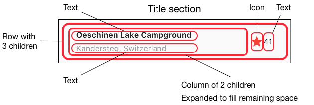
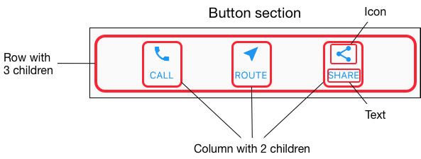

# 📘 Tugas Praktikum - Layout dan Navigasi

## 📝 Praktikum 1 : Membangun Layout di Flutter

**Langkah 1 : Buat Project Baru**

Buatlah sebuah project flutter baru dengan nama layout_flutter. Atau sesuaikan style laporan praktikum yang Anda buat.

**Langkah 2 : Buka file lib/main.dart**

Buka file main.dart lalu ganti dengan kode berikut. Isi nama dan NIM Anda di text title.

```dart
import 'package:flutter/material.dart';

void main() => runApp(const MyApp());

class MyApp extends StatelessWidget {
  const MyApp({super.key});

  @override
  Widget build(BuildContext context) {
    return MaterialApp(
      title: 'Flutter layout: Nama dan NIM Anda',
      home: Scaffold(
        appBar: AppBar(
          title: const Text('Flutter layout demo'),
        ),
        body: const Center(
          child: Text('Hello World'),
        ),
      ),
    );
  }
}
```

**Langkah 3 : Identifikasi layout diagram**

Langkah pertama adalah memecah tata letak menjadi elemen dasarnya:

- Identifikasi baris dan kolom.
- Apakah tata letaknya menyertakan kisi-kisi (grid)?
- Apakah ada elemen yang tumpang tindih?
- Apakah UI memerlukan tab?
- Perhatikan area yang memerlukan alignment, padding, atau borders.

Pertama, identifikasi elemen yang lebih besar. Dalam contoh ini, empat elemen disusun menjadi sebuah kolom: sebuah gambar, dua baris, dan satu blok teks.


Selanjutnya, buat diagram setiap baris. Baris pertama, disebut bagian Judul, memiliki 3 anak: kolom teks, ikon bintang, dan angka. Anak pertamanya, kolom, berisi 2 baris teks. Kolom pertama itu memakan banyak ruang, sehingga harus dibungkus dengan widget yang Diperluas.



Baris kedua, disebut bagian Tombol, juga memiliki 3 anak: setiap anak merupakan kolom yang berisi ikon dan teks.



Setelah tata letak telah dibuat diagramnya, cara termudah adalah dengan menerapkan pendekatan bottom-up. Untuk meminimalkan kebingungan visual dari kode tata letak yang banyak bertumpuk, tempatkan beberapa implementasi dalam variabel dan fungsi.